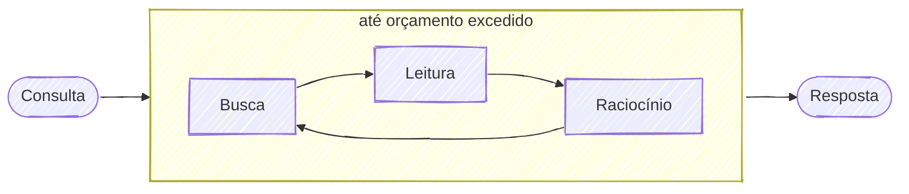

# DeepResearch

[Official UI](https://search.jina.ai/) | [UI Code](https://github.com/jina-ai/deepsearch-ui) | [Stable API](https://jina.ai/deepsearch) | [Blog](https://jina.ai/news/a-practical-guide-to-implementing-deepsearch-deepresearch)

Keep searching, reading webpages, reasoning until an answer is found (or the token budget is exceeded). Useful for deeply investigating a query.

> [!IMPORTANT]
> Unlike OpenAI/Gemini/Perplexity's "Deep Research", we focus solely on **finding the right answers via our iterative process**. We don't optimize for long-form articles, that's a **completely different problem** – so if you need quick, concise answers from deep search, you're in the right place. If you're looking for AI-generated long reports like OpenAI/Gemini/Perplexity does, this isn't for you.



## [Blog Post](https://jina.ai/news/a-practical-guide-to-implementing-deepsearch-deepresearch)

Whether you like this implementation or not, I highly recommend you to read DeepSearch/DeepResearch implementation guide I wrote, which gives you a gentle intro to this topic.

- [English Part I](https://jina.ai/news/a-practical-guide-to-implementing-deepsearch-deepresearch), [Part II](https://jina.ai/news/snippet-selection-and-url-ranking-in-deepsearch-deepresearch)
- [中文微信公众号 第一讲](https://mp.weixin.qq.com/s/-pPhHDi2nz8hp5R3Lm_mww), [第二讲](https://mp.weixin.qq.com/s/apnorBj4TZs3-Mo23xUReQ)
- [日本語: DeepSearch/DeepResearch 実装の実践ガイド](https://jina.ai/ja/news/a-practical-guide-to-implementing-deepsearch-deepresearch)

## Try it Yourself

We host an online deployment of this **exact** codebase, which allows you to do a vibe-check; or use it as daily productivity tools.

https://search.jina.ai

The official API is also available for you to use:

```
https://deepsearch.jina.ai/v1/chat/completions
```

Learn more about the API at https://jina.ai/deepsearch

## Install

```bash
git clone https://github.com/jina-ai/node-DeepResearch.git
cd node-DeepResearch
npm install
```

[安装部署视频教程 on Youtube](https://youtu.be/vrpraFiPUyA)

It is also available on npm but not recommended for now, as the code is still under active development.

## Usage

We use Gemini (latest `gemini-2.0-flash`) / OpenAI / [LocalLLM](#use-local-llm) for reasoning, [Jina Reader](https://jina.ai/reader) for searching and reading webpages, you can get a free API key with 1M tokens from jina.ai.

```bash
export GEMINI_API_KEY=...  # for gemini
# export OPENAI_API_KEY=... # for openai
# export LLM_PROVIDER=openai # for openai
export JINA_API_KEY=jina_...  # free jina api key, get from https://jina.ai/reader

npm run dev $QUERY
```

### Official Site

You can try it on [our official site](https://search.jina.ai).

### Official API

You can also use [our official DeepSearch API](https://jina.ai/deepsearch):

```
https://deepsearch.jina.ai/v1/chat/completions
```

You can use it with any OpenAI-compatible client.

For the authentication Bearer, API key, rate limit, get from https://jina.ai/deepsearch.

#### Client integration guidelines

If you are building a web/local/mobile client that uses `Jina DeepSearch API`, here are some design guidelines:

- Our API is fully compatible with [OpenAI API schema](https://platform.openai.com/docs/api-reference/chat/create), this should greatly simplify the integration process. The model name is `jina-deepsearch-v1`.
- Our DeepSearch API is a reasoning+search grounding LLM, so it's best for questions that require deep reasoning and search.
- Two special tokens are introduced `<think>...</think>`. Please render them with care.
- Citations are often provided, and in [Github-flavored markdown footnote format](https://github.blog/changelog/2021-09-30-footnotes-now-supported-in-markdown-fields/), e.g. `[^1]`, `[^2]`, ...
- Guide the user to get a Jina API key from https://jina.ai, with 1M free tokens for new API key.
- There are rate limits, [between 10RPM to 30RPM depending on the API key tier](https://jina.ai/contact-sales#rate-limit).
- [Download Jina AI logo here](https://jina.ai/logo-Jina-1024.zip)

## Demo

> was recorded with `gemini-1.5-flash`, the latest `gemini-2.0-flash` leads to much better results!

Query: `"what is the latest blog post's title from jina ai?"`
3 steps; answer is correct!


Query: `"what is the context length of readerlm-v2?"`
2 steps; answer is correct!


Query: `"list all employees from jina ai that u can find, as many as possible"`
11 steps; partially correct! but im not in the list :(


Query: `"who will be the biggest competitor of Jina AI"`
42 steps; future prediction kind, so it's arguably correct! atm Im not seeing `weaviate` as a competitor, but im open for the future "i told you so" moment.


More examples:

```
# example: no tool calling
npm run dev "1+1="
npm run dev "what is the capital of France?"

# example: 2-step
npm run dev "what is the latest news from Jina AI?"

# example: 3-step
npm run dev "what is the twitter account of jina ai's founder"

# example: 13-step, ambiguious question (no def of "big")
npm run dev "who is bigger? cohere, jina ai, voyage?"

# example: open question, research-like, long chain of thoughts
npm run dev "who will be president of US in 2028?"
npm run dev "what should be jina ai strategy for 2025?"
```

## Use Local LLM

> Note, not every LLM works with our reasoning flow, we need those who support structured output (sometimes called JSON Schema output, object output) well. Feel free to purpose a PR to add more open-source LLMs to the working list.

If you use Ollama or LMStudio, you can redirect the reasoning request to your local LLM by setting the following environment variables:

```bash
export LLM_PROVIDER=openai  # yes, that's right - for local llm we still use openai client
export OPENAI_BASE_URL=http://127.0.0.1:1234/v1  # your local llm endpoint
export OPENAI_API_KEY=whatever  # random string would do, as we don't use it (unless your local LLM has authentication)
export DEFAULT_MODEL_NAME=qwen2.5-7b  # your local llm model name
```

## OpenAI-Compatible Server API

If you have a GUI client that supports OpenAI API (e.g. [CherryStudio](https://docs.cherry-ai.com/), [Chatbox](https://github.com/Bin-Huang/chatbox)) , you can simply config it to use this server.


Start the server:

```bash
# Without authentication
npm run serve

# With authentication (clients must provide this secret as Bearer token)
npm run serve --secret=your_secret_token
```

The server will start on http://localhost:3000 with the following endpoint:

### POST /v1/chat/completions

```bash
# Without authentication
curl http://localhost:3000/v1/chat/completions \
  -H "Content-Type: application/json" \
  -d '{
    "model": "jina-deepsearch-v1",
    "messages": [
      {
        "role": "user",
        "content": "Hello!"
      }
    ]
  }'

# With authentication (when server is started with --secret)
curl http://localhost:3000/v1/chat/completions \
  -H "Content-Type: application/json" \
  -H "Authorization: Bearer your_secret_token" \
  -d '{
    "model": "jina-deepsearch-v1",
    "messages": [
      {
        "role": "user",
        "content": "Hello!"
      }
    ],
    "stream": true
  }'
```

Response format:

```json
{
  "id": "chatcmpl-123",
  "object": "chat.completion",
  "created": 1677652288,
  "model": "jina-deepsearch-v1",
  "system_fingerprint": "fp_44709d6fcb",
  "choices": [
    {
      "index": 0,
      "message": {
        "role": "assistant",
        "content": "YOUR FINAL ANSWER"
      },
      "logprobs": null,
      "finish_reason": "stop"
    }
  ],
  "usage": {
    "prompt_tokens": 9,
    "completion_tokens": 12,
    "total_tokens": 21
  }
}
```

For streaming responses (stream: true), the server sends chunks in this format:

```json
{
  "id": "chatcmpl-123",
  "object": "chat.completion.chunk",
  "created": 1694268190,
  "model": "jina-deepsearch-v1",
  "system_fingerprint": "fp_44709d6fcb",
  "choices": [
    {
      "index": 0,
      "delta": {
        "content": "..."
      },
      "logprobs": null,
      "finish_reason": null
    }
  ]
}
```

Note: The think content in streaming responses is wrapped in XML tags:

```
<think>
[thinking steps...]
</think>
[final answer]
```

## Docker Setup

### Build Docker Image

To build the Docker image for the application, run the following command:

```bash
docker build -t deepresearch:latest .
```

### Run Docker Container

To run the Docker container, use the following command:

```bash
docker run -p 3000:3000 --env GEMINI_API_KEY=your_gemini_api_key --env JINA_API_KEY=your_jina_api_key deepresearch:latest
```

### Docker Compose

You can also use Docker Compose to manage multi-container applications. To start the application with Docker Compose, run:

```bash
docker-compose up
```

## How Does it Work?

Not sure a flowchart helps, but here it is:


Vou analisar o repositório node-DeepResearch-jina e criar um documento similar ao schemas.md, focando apenas neste projeto.

Ran tool

Ran tool

Read file: /Users/williamduarte/Pesquisa_CMEX/cmex_poc/node-DeepResearch-jina/src/types.ts

Read file: /Users/williamduarte/Pesquisa_CMEX/cmex_poc/node-DeepResearch-jina/src/agent.ts

Read file: /Users/williamduarte/Pesquisa_CMEX/cmex_poc/node-DeepResearch-jina/src/app.ts

Ran tool

Read file: /Users/williamduarte/Pesquisa_CMEX/cmex_poc/node-DeepResearch-jina/src/utils/schemas.ts

Ran tool

Read file: /Users/williamduarte/Pesquisa_CMEX/cmex_poc/node-DeepResearch-jina/src/tools/jina-search.ts

Read file: /Users/williamduarte/Pesquisa_CMEX/cmex_poc/node-DeepResearch-jina/src/tools/jina-rerank.ts

Read file: /Users/williamduarte/Pesquisa_CMEX/cmex_poc/node-DeepResearch-jina/config.json
Baseado na análise dos arquivos do repositório node-DeepResearch-jina, vou criar um documento detalhado sobre os schemas e o fluxo de funcionamento.

# Análise de Schemas para Sistema node-DeepResearch-jina

## Índice

1. [Introdução](#introdução)
2. [Arquitetura do Sistema](#arquitetura-do-sistema)
3. [Fluxo de Dados](#fluxo-de-dados)
4. [Configuração do Sistema](#configuração-do-sistema)
5. [Schemas Utilizados](#schemas-utilizados)
   - [Schema de Ação Base](#schema-de-ação-base)
   - [Schema de Busca](#schema-de-busca)
   - [Schema de Resposta](#schema-de-resposta)
   - [Schema de Reflexão](#schema-de-reflexão)
   - [Schema de Visita](#schema-de-visita)
   - [Schema de Codificação](#schema-de-codificação)
   - [Schema de Referência](#schema-de-referência)
   - [Schema de Item de Conhecimento](#schema-de-item-de-conhecimento)
   - [Schema de Avaliação](#schema-de-avaliação)
   - [Schema de Análise de Erro](#schema-de-análise-de-erro)
   - [Schema de Reescrita de Consulta](#schema-de-reescrita-de-consulta)
6. [Ferramentas do Sistema](#ferramentas-do-sistema)
7. [Fluxo Detalhado do Processamento](#fluxo-detalhado-do-processamento)
8. [Provedores e Modelos Suportados](#provedores-e-modelos-suportados)
9. [API OpenAI-Compatível](#api-openai-compatível)
10. [Conclusão](#conclusão)

## Introdução

O sistema node-DeepResearch-jina é uma aplicação Node.js desenvolvida para realizar pesquisas profundas e iterativas, análise e recuperação de informações utilizando modelos de linguagem e APIs de busca. Este sistema implementa uma arquitetura baseada em agentes inteligentes capazes de realizar múltiplas etapas de raciocínio para responder a consultas complexas, utilizando diversas ferramentas e APIs, especialmente a API Jina AI para buscas e ranking de relevância.

De acordo com a documentação oficial, o foco do sistema é "encontrar as respostas certas através de um processo iterativo", ao contrário de outros sistemas que priorizam a geração de artigos longos.

## Arquitetura do Sistema

O sistema é construído com uma arquitetura modular composta por:

1. **Servidor Express**: Gerencia as requisições HTTP e implementa o streaming de respostas usando Server-Sent Events (SSE).
2. **Agente de Pesquisa**: Componente principal que coordena o fluxo de processamento e tomada de decisões.
3. **Ferramentas Especializadas**: Conjunto de módulos para tarefas específicas como busca, rerank, avaliação, etc.
4. **Sistemas de Validação**: Mecanismos para garantir a qualidade e relevância das respostas.
5. **Trackers**: Sistemas para monitorar o uso de tokens e ações realizadas.


## Fluxo de Dados

O fluxo de dados no sistema segue um processo iterativo, como ilustrado no README:


As etapas principais são:

1. **Recepção da Consulta**: O usuário envia uma consulta através de uma requisição HTTP.
2. **Preparação do Contexto**: O sistema inicializa trackers e contexto para a sessão.
3. **Ciclo de Ações**: O agente decide entre ações como busca, visita de URLs, reflexão ou resposta.
4. **Avaliação de Qualidade**: As respostas são avaliadas quanto à qualidade, atribuição e relevância.
5. **Streaming da Resposta**: O resultado é transmitido progressivamente ao cliente via SSE.

## Configuração do Sistema

O sistema utiliza um arquivo de configuração modular (`config.json`) que define provedores, modelos e parâmetros para cada componente:

```json
{
  "env": {
    "https_proxy": "",
    "OPENAI_BASE_URL": "",
    "GEMINI_API_KEY": "",
    "OPENAI_API_KEY": "",
    "JINA_API_KEY": "",
    "BRAVE_API_KEY": "",
    "SERPER_API_KEY": "",
    "DEFAULT_MODEL_NAME": ""
  },
  "defaults": {
    "search_provider": "jina",
    "llm_provider": "gemini",
    "step_sleep": 100
  },
  "providers": {
    "gemini": {
      "createClient": "createGoogleGenerativeAI"
    },
    "openai": {
      "createClient": "createOpenAI",
      "clientConfig": {
        "compatibility": "strict"
      }
    }
  },
  "models": {
    "gemini": {
      "default": {
        "model": "gemini-2.0-flash",
        "temperature": 0,
        "maxTokens": 2000
      },
      "tools": {
        "coder": { "temperature": 0.7 },
        "searchGrounding": { "temperature": 0 },
        "dedup": { "temperature": 0.1 },
        "evaluator": { "temperature": 0.6, "maxTokens": 200 },
        "errorAnalyzer": {},
        "queryRewriter": { "temperature": 0.1 },
        "agent": { "temperature": 0.7 },
        "agentBeastMode": { "temperature": 0.7 },
        "fallback": { "maxTokens": 8000, "model": "gemini-2.0-flash-lite" }
      }
    }
  }
}
```

## Schemas Utilizados

### Schema de Ação Base

Este schema define a estrutura base para todas as ações do sistema:

```typescript
type BaseAction = {
  action: "search" | "answer" | "reflect" | "visit" | "coding";
  think: string;
};
```

**Parâmetros**:

- **action**: Define o tipo de ação a ser executada.
- **think**: Contém o raciocínio por trás da ação.

### Schema de Busca

```typescript
export type SearchAction = BaseAction & {
  action: "search";
  searchRequests: string[];
};
```

**Parâmetros**:

- **action**: Definido como "search" para indicar uma operação de busca.
- **searchRequests**: Array de termos de busca a serem executados.

### Schema de Resposta

```typescript
export type AnswerAction = BaseAction & {
  action: "answer";
  answer: string;
  references: Array<Reference>;
  isFinal?: boolean;
  mdAnswer?: string;
};
```

**Parâmetros**:

- **action**: Definido como "answer" para indicar uma resposta.
- **answer**: Conteúdo da resposta para o usuário.
- **references**: Array de referências que fundamentam a resposta.
- **isFinal**: Indica se a resposta é final ou intermediária.
- **mdAnswer**: Versão da resposta formatada em Markdown.

### Schema de Reflexão

```typescript
export type ReflectAction = BaseAction & {
  action: "reflect";
  questionsToAnswer: string[];
};
```

**Parâmetros**:

- **action**: Definido como "reflect" para indicar uma pausa para análise.
- **questionsToAnswer**: Lista de perguntas que precisam ser respondidas para avançar.

### Schema de Visita

```typescript
export type VisitAction = BaseAction & {
  action: "visit";
  URLTargets: string[];
};
```

**Parâmetros**:

- **action**: Definido como "visit" para indicar visita a URLs.
- **URLTargets**: Lista de URLs a serem visitados para coleta de informações.

### Schema de Codificação

```typescript
export type CodingAction = BaseAction & {
  action: "coding";
  codingIssue: string;
};
```

**Parâmetros**:

- **action**: Definido como "coding" para indicar uma tarefa de programação.
- **codingIssue**: Descrição do problema de codificação a ser resolvido.

### Schema de Referência

```typescript
export type Reference = {
  exactQuote: string;
  url: string;
  title: string;
  dateTime?: string;
};
```

**Parâmetros**:

- **exactQuote**: Citação exata da fonte referenciada.
- **url**: URL da fonte.
- **title**: Título da fonte.
- **dateTime**: Data e hora da fonte (opcional).

### Schema de Item de Conhecimento

```typescript
export type KnowledgeItem = {
  question: string;
  answer: string;
  references?: Array<Reference> | Array<any>;
  type: "qa" | "side-info" | "chat-history" | "url" | "coding";
  updated?: string;
  sourceCode?: string;
};
```

**Parâmetros**:

- **question**: A pergunta associada ao item de conhecimento.
- **answer**: A resposta ou informação armazenada.
- **references**: Lista de referências que fundamentam o conhecimento.
- **type**: Tipo do item de conhecimento (pergunta-resposta, informação lateral, histórico de chat, URL ou código).
- **updated**: Data e hora da última atualização.
- **sourceCode**: Código-fonte associado (para itens de tipo 'coding').

### Schema de Avaliação

```typescript
export type EvaluationResponse = {
  pass: boolean;
  think: string;
  type?: EvaluationType;
  freshness_analysis?: {
    days_ago: number;
    max_age_days?: number;
  };
  plurality_analysis?: {
    minimum_count_required: number;
    actual_count_provided: number;
  };
  exactQuote?: string;
  completeness_analysis?: {
    aspects_expected: string;
    aspects_provided: string;
  };
  improvement_plan?: string;
};
```

**Parâmetros**:

- **pass**: Indica se a resposta passou na avaliação.
- **think**: Análise do processo de avaliação.
- **type**: Tipo de avaliação realizada.
- **freshness_analysis**: Análise de atualidade da informação.
- **plurality_analysis**: Análise da quantidade de itens fornecidos na resposta.
- **exactQuote**: Citação exata que sustenta a resposta.
- **completeness_analysis**: Análise de completude da resposta.
- **improvement_plan**: Plano para melhorar a resposta.

### Schema de Análise de Erro

```typescript
export type ErrorAnalysisResponse = {
  recap: string;
  blame: string;
  improvement: string;
};
```

**Parâmetros**:

- **recap**: Resumo das ações tomadas até o momento.
- **blame**: Identificação da causa raiz do erro.
- **improvement**: Sugestões para melhorar o processo na próxima iteração.

### Schema de Reescrita de Consulta

```typescript
export type QueryRewriterSchema = {
  think: string;
  queries: Array<{
    tbs: "qdr:h" | "qdr:d" | "qdr:w" | "qdr:m" | "qdr:y";
    gl: string;
    hl: string;
    location?: string;
    q: string;
  }>;
};
```

**Parâmetros**:

- **think**: Explicação sobre a escolha dos termos de busca.
- **queries**: Array de consultas formatadas com parâmetros específicos:
  - **tbs**: Filtro de tempo para a busca.
  - **gl**: Código do país para a busca.
  - **hl**: Código do idioma para a busca.
  - **location**: Localização para simular a origem da busca.
  - **q**: Termos de busca.

## Ferramentas do Sistema

O sistema utiliza diversas ferramentas especializadas:

1. **jina-search**: Realiza buscas usando a API Jina AI.
2. **jina-rerank**: Reordena resultados por relevância.
3. **jina-dedup**: Elimina consultas duplicadas ou redundantes.
4. **jina-latechunk**: Processa chunks de informação tardios.
5. **evaluator**: Avalia a qualidade das respostas.
6. **error-analyzer**: Analisa erros e falhas no processo.
7. **query-rewriter**: Reformula consultas para melhorar resultados.
8. **brave-search**: Alternativa de busca usando a API Brave.
9. **serper-search**: Alternativa de busca usando a API Serper.
10. **code-sandbox**: Ambiente para execução e teste de código.
11. **md-fixer**: Corrige formatação de Markdown nas respostas.
12. **read**: Lê e processa conteúdo de URLs.

## Fluxo Detalhado do Processamento

O fluxo detalhado do sistema, baseado no README e análise do código:


## Provedores e Modelos Suportados

O sistema suporta múltiplos provedores de modelos de linguagem e serviços de busca:

1. **Modelos de Linguagem**:

   - **Gemini**: Modelos do Google AI (gemini-2.0-flash, gemini-2.0-flash-lite)
   - **OpenAI**: Modelos da OpenAI (gpt-4o-mini)
   - **Modelos Locais**: Suporte para modelos locais via Ollama ou LMStudio

2. **Provedores de Busca**:

   - **Jina AI**: Principal provedor de busca, com APIs para busca e rerank.
   - **Brave Search**: Alternativa para busca web.
   - **Serper**: Interface para o Google Search.

## API OpenAI-Compatível

O sistema implementa uma API compatível com OpenAI, permitindo integração com clientes existentes:

### Endpoint: POST /v1/chat/completions

```bash
curl http://localhost:3000/v1/chat/completions \
  -H "Content-Type: application/json" \
  -d '{
    "model": "jina-deepsearch-v1",
    "messages": [
      {
        "role": "user",
        "content": "Hello!"
      }
    ],
    "stream": true
  }'
```

Formato de resposta:

```json
{
  "id": "chatcmpl-123",
  "object": "chat.completion",
  "created": 1677652288,
  "model": "jina-deepsearch-v1",
  "system_fingerprint": "fp_44709d6fcb",
  "choices": [
    {
      "index": 0,
      "message": {
        "role": "assistant",
        "content": "RESPOSTA FINAL"
      },
      "logprobs": null,
      "finish_reason": "stop"
    }
  ],
  "usage": {
    "prompt_tokens": 9,
    "completion_tokens": 12,
    "total_tokens": 21
  }
}
```

Para respostas em streaming (stream: true), o servidor envia chunks neste formato:

```json
{
  "id": "chatcmpl-123",
  "object": "chat.completion.chunk",
  "created": 1694268190,
  "model": "jina-deepsearch-v1",
  "system_fingerprint": "fp_44709d6fcb",
  "choices": [
    {
      "index": 0,
      "delta": {
        "content": "..."
      },
      "logprobs": null,
      "finish_reason": null
    }
  ]
}
```

## Conclusão

O sistema node-DeepResearch-jina representa uma implementação avançada de um agente de pesquisa que utiliza múltiplos modelos de linguagem e APIs para responder consultas complexas. A arquitetura modular e o uso de schemas bem definidos permitem um fluxo de trabalho estruturado e adaptável.

O sistema se destaca por:

1. **Raciocínio em Múltiplas Etapas**: Capacidade de decompor problemas complexos em sub-tarefas.
2. **Validação Rigorosa**: Mecanismos para avaliar a qualidade, atualidade e relevância das respostas.
3. **Flexibilidade de Provedores**: Suporte a múltiplos modelos de linguagem e serviços de busca.
4. **Streaming em Tempo Real**: Entrega progressiva de respostas via SSE.
5. **Auto-correção**: Capacidade de analisar falhas e melhorar iterativamente.
6. **API Compatível**: Implementação de uma API compatível com OpenAI para fácil integração.

A estrutura de schemas bem definida e o sistema de tipos em TypeScript garantem consistência e confiabilidade, permitindo que o sistema execute tarefas complexas de busca e análise de informações de forma estruturada e eficiente.
